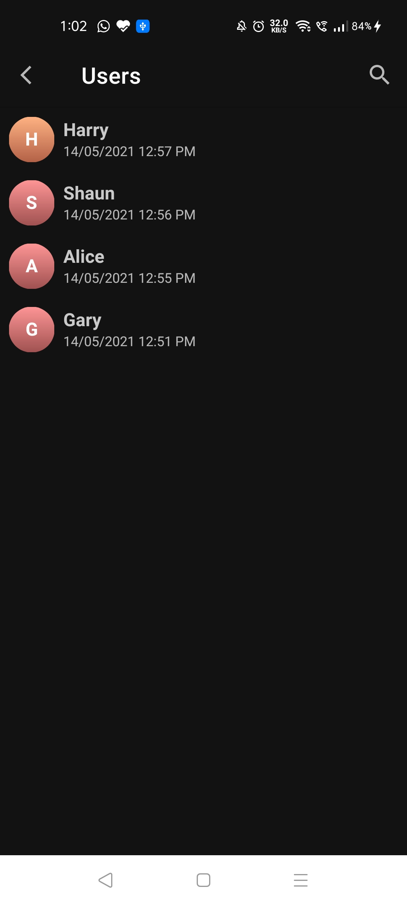

# Description 

- Implementation of [STREAM CHAT](https://github.com/GetStream/stream-chat-android) SDK for Android Using KOTLIN
- Application Name - **STREAM CHAT**
- Language Used - Kotlin (v1.3.72)  
- IDE used - Android Studio (v4.1.2)  
- Get More Information and Documentation from [here](https://getstream.io/)

# Screenshots (DAY)

 | Login Screen | Channels Screen | Users Screen | Chat Screen | Chat Screen | 
 --------------|------------|-------------|-----------|-----------|
 |  |   |  |  | 
 
 # Screenshots (DARK)

 | Login Screen | Channels Screen | Users Screen | Chat Screen | Chat Screen | 
 --------------|------------|-------------|-----------|-----------|
 |  |   |  |  | 
 
 
